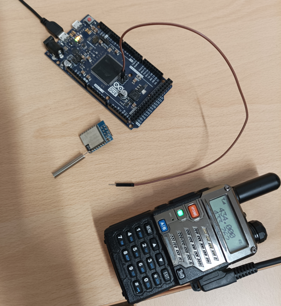
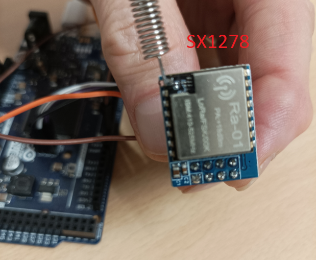
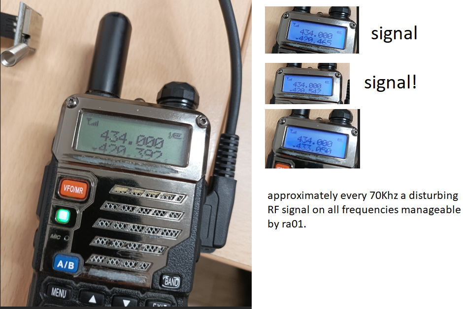

# sx1278Bug
possible hardware bug in sx1278 chips

 I have encountered a strange phenomenon with SX1278, in particular I am using Arduino Due and the RA01 module inside which there is sx1278.

------ 09/12/2024 UPDATE -------------------------------------------------------------------------------------------
Bug is not a bug!
It's just my inexperience.
This can still help those who want to use this module with Arduino Due and maybe even with other Arduinos.
Avoid polling and/or improve the spi connections.

In practice, as you can see from the photo, a piece of cable connected to the SCK of the SPI is enough to generate the noise.
Noise that greatly reduces the reception capacity of the SX1278.

 

---------------------------------------------------------------------------------------------------------------------

 

 Pin 10 of Arduino Due connected to NSS of RA01 module
 
 Pin 9 connected to RST
 
 Pin 2 connected to DIO0
 
 Pin 3.3 volt of Arduino Due connected to 3v3 of RA01 module
 
 Pin GND connected to GND
 
 Pin SCK MISO and MOSI of Arduino Due SPI connector connected to the respective pins on RA01.

 I noticed problems with this low sensitivity SX1278 in reception and I investigated a lot.
 What I found leaves me perplexed but it is so striking that I share it here.
 I hope that someone with more equipment than I have (spectrum analyzer) can investigate
 better than me.
 
 In some libraries, instead of using an interrupt approach, a polling approach is used
 in which the RegIrqFlags register (0x12) is continuously polled in order to
 determine when a packet has been received.

 Well I realized that this continuous polling is the source of the problems.
 Incredibly I realized that just polling any register
 the problem appears!
 
 So I wrote this code that intentionally does not use any library and that limits itself to polling 
 and I chose to use the RegVersion register at address 0x42.

 If you look at the code you are led to think that nothing will happen.
 Instead with this code in operation the module transmits a weak RF signal
 receivable (with my limited equipment) up to ten meters.
 It transmits many carriers at different frequencies spaced about 70Khz apart.
 All this signal disturbs the other receivers placed in the vicinity including
 itself if the module were actually in reception.
 The polling of RegIrqFlags disturbs the reception of the packet you want to receive.

 You are invited to verify what I have discovered and to let me know if you also encounter this phenomenon.

 Antonio_prev@hotmail.com

 ## Arduino Due Code

```c++
#include <Arduino.h>
#include <SPI.h>

uint8_t RegVersion = 0x42;


uint8_t spi_readRegister(uint8_t address)
{
    uint8_t response;
    
    address = address & 0x7F;

    digitalWrite(10, LOW);

    SPI.beginTransaction(SPISettings(8000000, MSBFIRST, SPI_MODE0));
    SPI.transfer(address);
    response = SPI.transfer(0x00);
    SPI.endTransaction();

    digitalWrite(10, HIGH);

    return response;
}


void setup() {

  // Begin serial communication
  Serial.begin(9600);
  while (!Serial);

  pinMode(10, OUTPUT);
  digitalWrite(10, HIGH);

  delay(100);    // little delay to wait start module.
  Serial.println("Start verification module");
  
  SPI.begin();

  if (spi_readRegister(RegVersion) == 0x12)
  {
      Serial.println("Ok mudule");
  }
  else
  {
      Serial.println("Error mudule not return 0x12 in RegVersion");
  }


  Serial.println("Now with your rf electronics lab equipment check if the module is transmitting any signals.");
  Serial.println("Please share with me your observations and conclusions.");
  Serial.println("Antonio_prev@hotmail.com");
  Serial.println("https://github.com/AntonioPrevitali/sx1278Bug");


}

void loop() {
  // infinite polling of RegVersion
  spi_readRegister(RegVersion);
}

```

 
